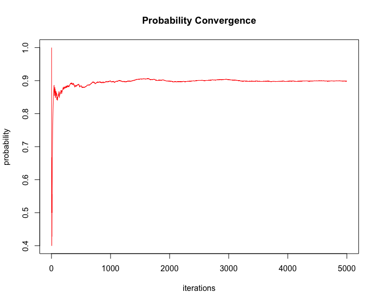

<!-- README.md is generated from README.Rmd. Please edit that file -->

```{r, include = FALSE}
knitr::opts_chunk$set(
  collapse = TRUE,
  comment = "#>",
  fig.path = "man/figures/README-"
)
```

# billmillr

**Author:** [Matthew Hoff](https://github.com/mghoff)
<br/>
**License:** [MIT](https://opensource.org/licenses/MIT)<br/>

[](https://www.repostatus.org/)
[](https://ci.appveyor.com/project/leonawicz/epubr)

## The Premise

This package calculates "The Bill Miller Problem" from Leonard Mlodinow's "The Drunkard's Walk: *How Randomness Rules Our Lives*".

The premise of this story goes that Bill Miller (financier) was an amazing stock picker after having performed incredibly well - beating the market over 15 consecutive years. As a result, he was celebrated and acclaimed by the likes of Forbes and others, who claimed that the likelihood of his ability to perform this well was 1 in 32,768. Dr., Mlodinow ups this likelihood, stating that the probability that any 1 person among 1000 who started "tossing coins" (i.e. picking stocks) was closer to 3%.

Dr. Mlodinow then further ups the probability, considering the likelihood that any 1 person over a 40 year period seeing that level of success, defined as beating the market for 15 years in a row or longer, is roughly 3 out of 4, or 75%.

**The resulting likelihood for any one person to beat the market within a definite start and stop time of at least 15 years in a single 40 year period, while larger the the 3% of his second calculation, is much smaller than the final proposed result of ~75%, which this calculates at ~33%.**

## The Math

#### Part 1:
One must compute the odds of getting a run (Streak) of at least k heads out of N coin tosses where p (q = 1-p)
is the probability of obtaining heads (tails) from the toss of a coin.

Mathematically, 

$$S[N, K] = p^k + \sum_{j=1, K} \{ p^{(j-1)} (1-p) S[N-j, K] \}$$

which can be broken down recursively into the sum of terms:

$$S[n, k] = p^k + ... = \sum_{j=1, k} \{ p^{(j-1)} (1-p) S[n-j, k] \} \text{ for } 1 \le j \le k$$

which is provided by `odds_of_streak()`.

For more information on the math behind this recursive odds calculation, see this
[Ask A Mathematician](https://www.askamathematician.com/2010/07/q-whats-the-chance-of-getting-a-run-of-k-successes-in-n-bernoulli-trials-why-use-approximations-when-the-exact-answer-is-known/) post.


#### Part 2:
To calculate the likelihood that at least x out of M people will obtain a streak of at least k Heads out of N coin tosses, one must perform the following:

1. Calculate the pdf: 

$\mathrm{P}(X=x)={M \choose x}p^{x}(1-p)^{(M-x)}$

2. Calculate the cdf: 

$\mathrm{P}(X \le x) = \sum_{i=0,x} \mathrm{pdf} \text{ for } {i \le x}$

3. Finally, calculate:

$\mathrm{P}(X > x) = 1 - \mathrm{P}(X \le x) \text{; i.e. } (1) - (2)$

which is provided by `prob_of_at_least_k()`.


## Example 1: Mathematical Proof

Load Package...

```{r load-pkg}
library(billmillr)
```

Calculate the likelihood of a streak of at least 5 heads out of 10 coin tosses
given that the probability p (q) of heads (tails) is fair, i.e. p = q = 0.5.

```{r prob-of-streak}
pS <- odds_of_streak(numCoins = 10, minHeads = 5, probHeads = 0.5)
pS

# # Example from "The Drunkard's Walk: How Randomness Rules Our Lives"
# tictoc::tic()
# oddsOfStreak(40, 15, 0.5) # p = 0.000411981; NOTE: for the @Risk simulation, we got 0.0002 - i.e. this is within bounds.
# tictoc::toc() # 24713.89 sec elapsed (6.865 hours)
```

Now calculate the probability that at least 1 out of 5 people will obtain
such a streak given that the probability of said streak is `r pS`.

```{r prob-at-least-k}
pK <- prob_of_at_least_k(N = 5, K = 1, P = pS)
pK

# # Example from "The Drunkard's Walk: How Randomness Rules Our Lives" continued...
# # Result (1): P(X = k) where k = 0
# choose(n, k)*(p**k)*((1-p)**(n-k))
# # P(X = 0) ~= 0.66 => P(X > 0) ~= 1 - 0.66 = 0.33
```


## Example 2: Simulation

Run a simulation on the problem, and return the set of resulting data
```{r run-simulation}
sim_data <- run_simulation(iters = 5000)
tail(sim_data)
```

Plot the probability convergence of the simulation results
<p></p>

Calculate the probability of obtaining zero streaks...
```{r zero-prob-calc}
tail(sim_data, n = 1)
nrow(sim_data[which(sim_data$applicable_trials == 0), ]) / nrow(sim_data)
```

...followed by the probability of at least 1 streak.
```{r final-prob-calc}
# Probability of at least 1 streak; i.e. 1 - P(0)
1 - (nrow(sim_data[which(sim_data$applicable_trials == 0), ]) / nrow(sim_data))
```
