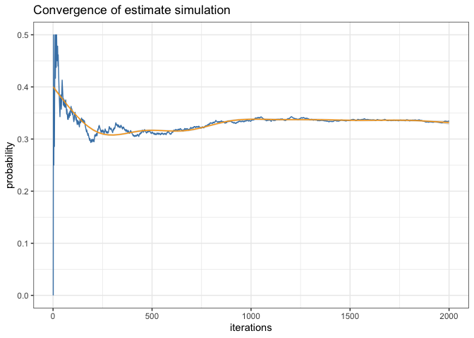
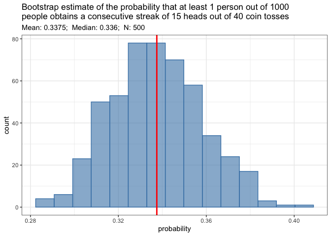

billmillr
================

<!-- README.md is generated from README.Rmd. Please edit that file -->

**Author:** [Matthew Hoff](https://github.com/mghoff) <br/> **License:**
[MIT](https://opensource.org/licenses/MIT)<br/>

[](https://www.repostatus.org/)
[](https://ci.appveyor.com/project/leonawicz/epubr)

## Why you should care about this package

This package provides functions & documentation for solving “The Bill
Miller Problem” presented within theoretical physicist & mathematician
[Leonard Mlodinow](https://en.wikipedia.org/wiki/Leonard_Mlodinow)’s
book entitled [*The Drunkard’s Walk: How Randomness Rules Our
Lives*](https://www.amazon.com/Drunkards-Walk-Randomness-Rules-Lives/dp/0307275175).
More generally, the functions herein can be used to solve for - either
analytically or by simulation - the likelihood of obtaining a winning
streak of given length within a given number of attempts, as attempted
by a specified number of individuals.

## Installation

This package can be installed directly from GitHub via the `remotes`
package.

``` r
remotes::install_github("mghoff/billmillr")
```

## The Premise

The story goes that [Bill
Miller](https://en.wikipedia.org/wiki/Bill_Miller_(investor)) (financier
& hedge fund manager) was perceived as *the* premier stock picker after
having performed incredibly well over 15 consecutive years (i.e. by
beating the S&P-500 stock index each year). As a result, he was
celebrated and acclaimed by the likes of Forbes and others, who
estimated and published statistics on the odds of his success. They
estimated that the likelihood of his being this performant by random
chance alone was 1 in 32,768 or \~0.0032%. This estimate is roughly true
if one considers only one individual - Bill Miller, in this case -
picking stocks. In other words, they claimed his 15-year winning streak
is very likely *not* driven by random chance alone, but instead by his
knowledge and intuition of the market - allowing him to skillfully pick
winning stocks seemingly at will.

However, what Dr. Mlodinow understood and illustrated in his book is
that there are/were many hedge fund managers all picking stocks. Based
on this fact, he poses the first of two refinements to the above
estimation: “Out of 1000 stock pickers (coin tossers), what are the odds
that at least 1 of them beats the market every year over 15 consecutive
years?” The answer to that question is roughly 3% - far greater than the
original estimate of 0.0032%. **This is trivial to verify.**

The second and final refinement Dr. Mlodinow poses considers the
scenario of beating the market 15 years consecutively or longer within a
40 year period; i.e. over 40 years and with 1000 traders, what is the
probability that at least 1 trader will obtain a winning streak of at
least 15 years given that the odds of winning (beating the S&P-500) in
any given year are equal to 0.5 (a fair coin toss)? On this additional
refinement, Dr. Mlodinow claims the odds are roughly 3 out of 4, or 75%;
*however, he provides no proof for this claim.*

*Using the functions within this package, one can calculate - again,
both analytically and by numerical simulation - these odds within a high
degree of accuracy. It is found that the odds estimate of these two
refinements is roughly \~33.7%… quite different still from the claimed
75%.*

### The Math

#### Part 1:

One must compute the odds of getting a run (i.e. streak) of at least k
heads out of N coin tosses where p (q = 1-p) is the probability of
obtaining heads (tails) from the toss of a coin.

Mathematically,

  
} (1-p) S[N-j, K] \}")

which can be broken down recursively into the following sum of terms:

  
} (1-p) S[n-j, k] \} \text{ for } 1 \le j \le k")

This sum of terms is provided by `odds_of_streak()`.

*For more information, see this [Ask A
Mathematician](https://www.askamathematician.com/2010/07/q-whats-the-chance-of-getting-a-run-of-k-successes-in-n-bernoulli-trials-why-use-approximations-when-the-exact-answer-is-known/)
post.*

#### Part 2:

To calculate the likelihood that at least j out of M people will obtain
a streak of at least k heads out of N coin tosses, one must perform the
following:

1.  Calculate the PDF:

  
 = {M \choose j}p^{j}(1-p)^{(M-j)}")

Again, this is provided by `odds_of_streak()`.

2.  Next, calculate the CDF:

  
 = \sum_{i=0,x} \mathrm{pdf} \text{ for } {i \le x}")

3.  And lastly, calculate the final result:

  
 = 1 - \mathrm{P}(X \le x) \text{;  i.e. } (1) - (2)")

which is provided by `prob_of_at_least_k()`.

### Examples

#### Example 1: Mathematical Proof

Load Package…

``` r
library(billmillr)
```

In the context of the Bill Miller problem, we calculate the probability
of obtaining a winning streak of at least 15 heads out of 40 coin
tosses, given that the probability p (q) of heads (tails) is fair,
i.e. p = q = 0.5.

``` r
tictoc::tic()
pS <- odds_of_streak(num_coins = 40, min_heads = 15, prob_heads = 0.5)
pS
#> [1] 0.000411981018260121
tictoc::toc(func.toc = msg.toc)
#> 16.474 hours elapsed

sessionInfo()
#> R version 4.1.2 (2021-11-01)
#> Platform: aarch64-apple-darwin20 (64-bit)
#> Running under: macOS Monterey 12.3.1

#> Matrix products: default
#> LAPACK: /Library/Frameworks/R.framework/Versions/4.1-arm64/Resources/lib/libRlapack.dylib

#> locale:
#> [1] en_US.UTF-8/en_US.UTF-8/en_US.UTF-8/C/en_US.UTF-8/en_US.UTF-8

#> attached base packages:
#> [1] stats graphics grDevices utils datasets methods base     

#> other attached packages:
#> [1] billmillr_0.2.5

#> loaded via a namespace (and not attached):
#> [1] compiler_4.1.2 tictoc_1.0.1 tools_4.1.2   
```

Using `pS`, we can now calculate the probability that at least 1 person
out of 1000 people will obtain such a winning streak.

``` r
pK <- prob_of_at_least_k(N = 1000, K = 1, p = pS)
pK
#> [1] 0.3377194
```

#### Example 2: Simulation

Simulate and return resulting data

``` r
set.seed(1203)
tictoc::tic()
sim_data <- run_simulation(
  iters = 2000,
  trials = 1000, # Number of traders
  sample_space = c("H", "T"),
  sample_size = 40, # Number of years
  run_value = "H",
  run_length = 15 # Number of consecutive winning years
)
tictoc::toc()
#> 39.241 sec elapsed

sim_data[2000, 3:4]
#>      prob_of_zero prob_of_ge_one
#> 2000        0.666          0.334
```

<!-- -->

And finally, run a small bootstrap sampling of the simulation…

``` r
# Number of times to run the simulation
bsn <- 500
# Build an empty matrix of proper dimensions to capture results 
bs_sim_mtx <- matrix(
  data = 0, nrow = bsn, ncol = 2,
  dimnames = list(c(), c("prob_of_zero", "prob_of_ge_one"))
)

# Run and time a bootstrap sampling estimate of the above simulation
tictoc::tic()
for (bsi in 1:bsn) {
  dat <- run_simulation(
    iters = 2000,
    trials = 1000, # Number of traders
    sample_space = c("H", "T"),
    sample_size = 40, # Number of years
    run_value = "H",
    run_length = 15 # Number of consecutive winning years
  )
  # Take the last row from simulation data above as i-th entry into matrix
  bs_sim_mtx[bsi, ] <- as.matrix(dat[bsn, 3:4])
}
tictoc::toc(func.toc = msg.toc)
#> 5.148 hours elapsed

colMeans(bs_sim_mtx)
#>   prob_of_zero prob_of_ge_one 
#>        0.66252        0.33748
```

<!-- -->
